# Sauron - IPv4 Scoring Engine Architecture

High-speed IPv4 threat/risk scoring engine implemented as a C shared library (libsauron) with Python bindings and CLI utility.

## Overview

Sauron is a re-implementation of ATT-CSOTE scoring engine concepts without external database dependencies (Redis). It provides in-memory storage and retrieval of IP risk/threat scores optimized for the nature of IPv4 address space.

### Design Goals

1. **Ultra-high throughput**: 50-120M events/minute (833K-2M events/second)
2. **Low latency**: Lock-free reads, minimal write contention
3. **Memory efficient**: Only allocate for active IP ranges
4. **Thread safe**: Concurrent reads and writes from multiple threads
5. **Persistent**: Archive/restore state across restarts
6. **Simple integration**: C library with Python bindings

### Primary Use Case

Integration with Specter_AI for real-time threat scoring of network events. Each event may contain multiple IP addresses that need score lookups and updates.

## System Architecture

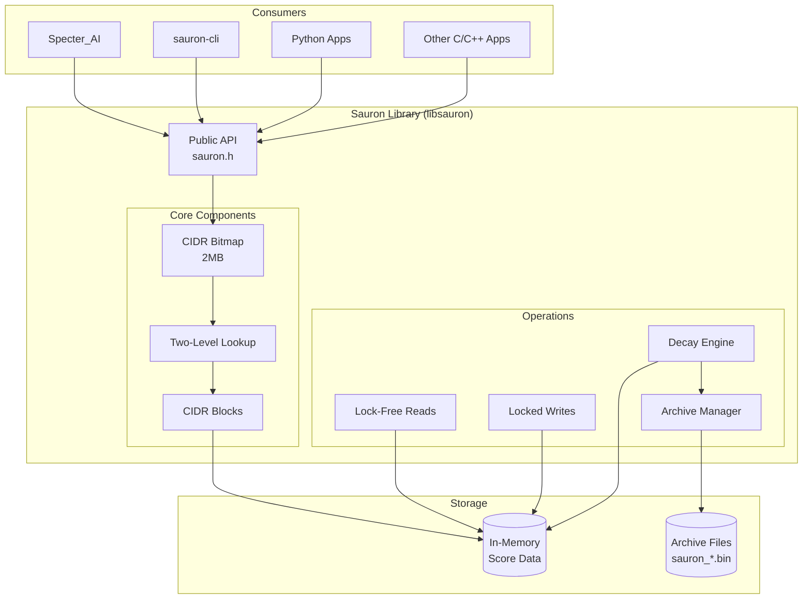

## Data Structure Design

### The IPv4 Addressing Challenge

IPv4 has 2^32 (4.3 billion) possible addresses. Naive approaches have problems:

| Approach | Memory | Lookup | Problem |
|----------|--------|--------|---------|
| Full array | 8GB+ | O(1) | Wasteful - most IPs never seen |
| Hash table | Variable | O(1) avg | Collisions, overhead |
| Trie | Variable | O(32) | Pointer chasing, cache misses |

### Solution: Hierarchical Block Structure with Bitmap Filter

We exploit two key insights:

1. **Sparsity**: Only a small fraction of IPv4 space has scores
2. **Locality**: IPs tend to cluster in /24 networks (same organization)

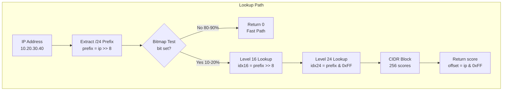

### Memory Layout

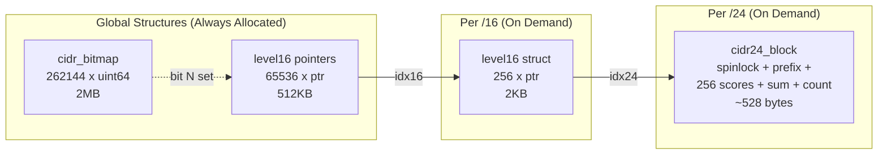

### CIDR Block Structure

```c
typedef struct cidr24_block {
    spinlock_t lock;          // Per-block write lock (4 bytes)
    uint32_t prefix;          // /24 identifier (4 bytes)
    int16_t scores[256];      // Individual IP scores (512 bytes)
    int32_t sum;              // Sum of non-zero scores (4 bytes)
    uint16_t count;           // Count of non-zero scores (2 bytes)
    uint16_t _padding;        // Alignment (2 bytes)
} cidr24_block_t;             // Total: ~528 bytes per /24
```

### Memory Usage Examples

| Scenario | Active /24s | Active /16s | Memory |
|----------|-------------|-------------|--------|
| Small deployment | 100 | 50 | 2.6MB + 100KB + 53KB = ~2.8MB |
| Medium deployment | 10,000 | 1,000 | 2.6MB + 2MB + 5.3MB = ~10MB |
| Large deployment | 100,000 | 10,000 | 2.6MB + 20MB + 53MB = ~76MB |

## Lookup Algorithm

### Read Path (Lock-Free)

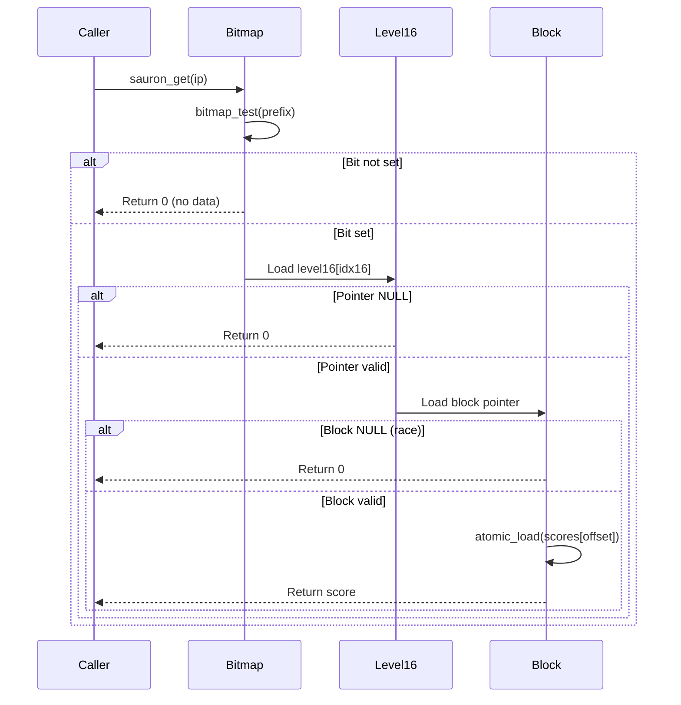

### Write Path (Per-CIDR Locked)

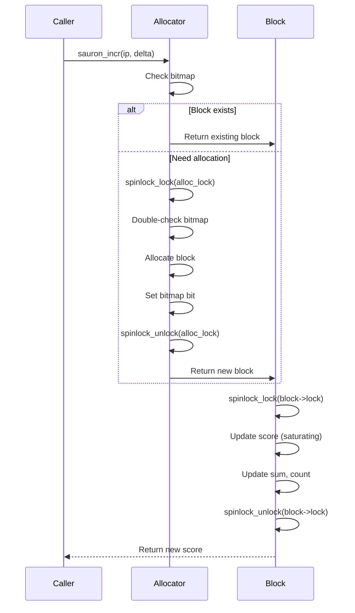

## Score Values

### Range and Semantics

- **Type**: int16_t
- **Range**: -32767 to +32767
- **Negative**: More trusted (known good actors)
- **Positive**: Higher risk/threat (suspicious or malicious)
- **Zero**: Neutral / no data (equivalent states)

### Saturating Arithmetic

Scores clamp at boundaries - no overflow/underflow:

```c
// Increment with saturation
int32_t new_val = (int32_t)old_score + delta;
if (new_val > 32767) new_val = 32767;
if (new_val < -32767) new_val = -32767;
score = (int16_t)new_val;
```

### CIDR Aggregation

Each /24 block maintains aggregate statistics:

- `sum`: Running sum of all non-zero scores
- `count`: Number of IPs with non-zero scores
- **Average risk**: `sum / count` (computed by caller)

This enables queries like "what's the aggregate risk for 10.20.30.0/24?"

## Traffic Analysis and Optimization

### Expected Traffic Distribution

Based on Specter_AI use case analysis:

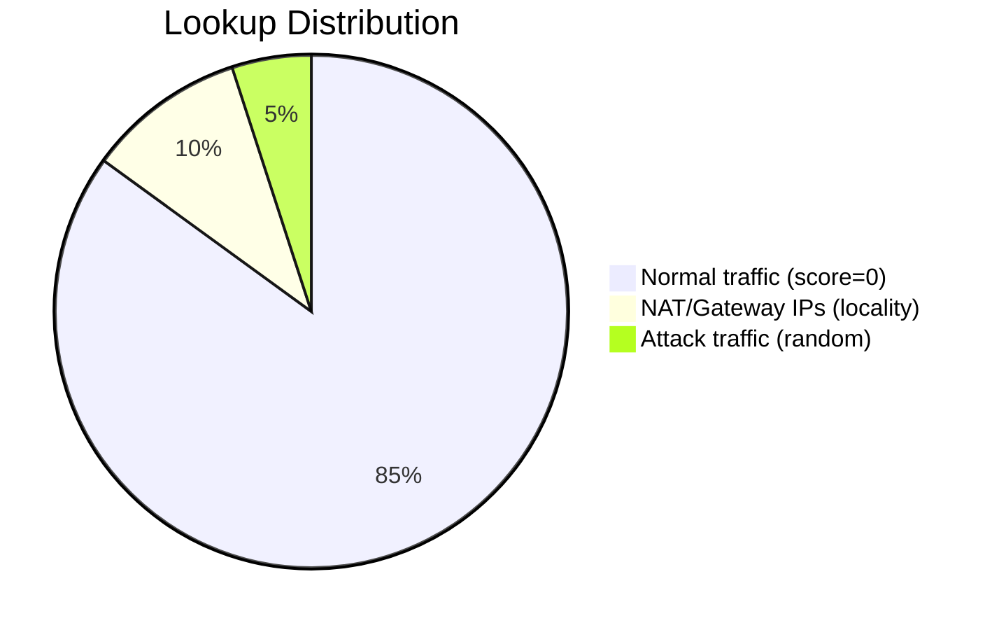

### Optimization Strategy

| Traffic Type | % | Handling | Performance |
|--------------|---|----------|-------------|
| Normal (no score) | 80-90% | Bitmap returns 0 | ~3 cycles |
| NAT/Gateway | 8-15% | Cached /16 blocks | ~10-20 cycles |
| Attack/Random | 2-5% | Full lookup | ~100-300 cycles |

**Key insight**: The bitmap filter eliminates 80-90% of lookups before touching any score data.

## IP Address Handling

All IPv4 addresses can be scored. Applications should implement their own filtering if certain ranges should be excluded.

**Note**: Duplicate IPs from different network segments share scores. This is acceptable for aggregate risk assessment.

## Thread Safety

### Access Pattern Assumptions

- **Reads**: Very frequent (every event, multiple IPs)
- **Writes**: Infrequent (threat indicators, external feeds)
- **Decay**: Batched, periodic (hourly), touches all blocks

### Locking Strategy

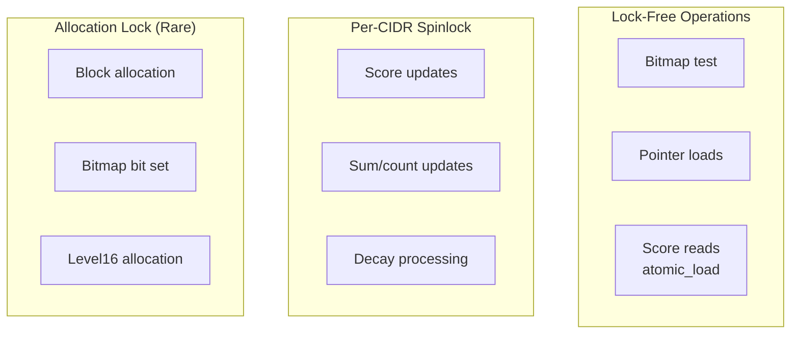

### Block Deallocation Safety

When decay empties a block, race-free ordering:

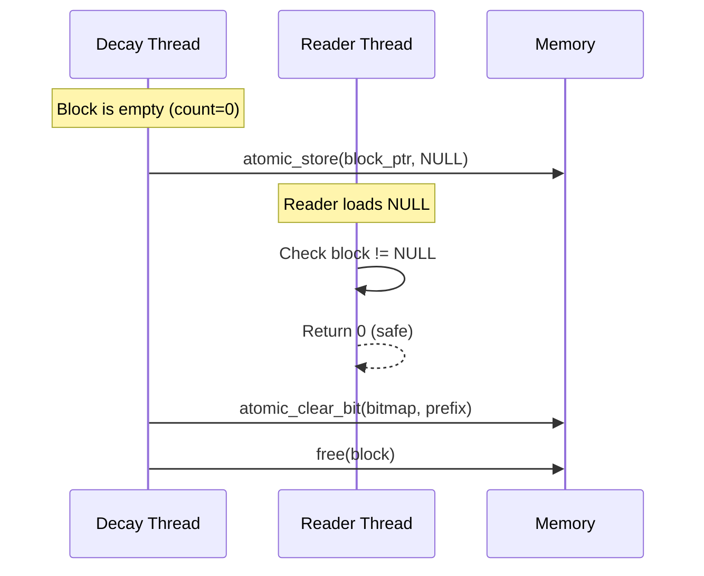

## Decay System

### Behavior

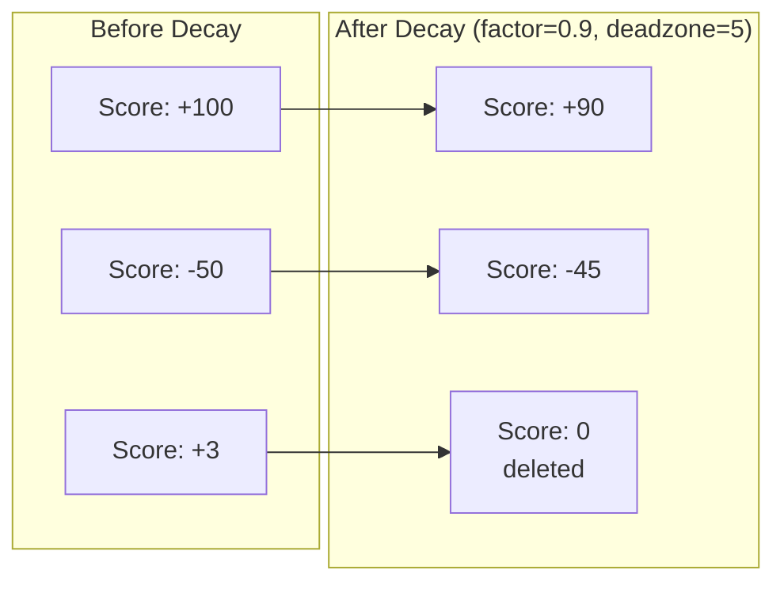

### Decay Algorithm

```
For each active /24 block:
    spinlock_lock(block->lock)
    for each score in block:
        if score > 0:
            new_score = score * decay_factor
            if new_score < deadzone: new_score = 0
        else if score < 0:
            new_score = score * decay_factor
            if new_score > -deadzone: new_score = 0

        if new_score != score:
            update score
            update sum, count

    if count == 0:
        mark block for deallocation
    spinlock_unlock(block->lock)

Deallocate empty blocks (safe ordering)
```

### Archive on Decay

Since decay touches all blocks, archiving piggybacks efficiently:

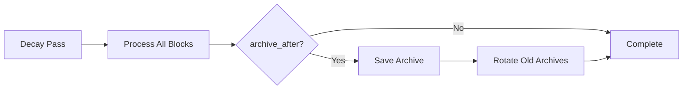

## Persistence

### Archive Format

Binary format with version header for forward compatibility:

```
┌─────────────────────────────────────┐
│ Header (22 bytes)                   │
├─────────────────────────────────────┤
│ magic: "SAUR" (4 bytes)             │
│ version: uint16 (2 bytes)           │
│ timestamp: uint64 (8 bytes)         │
│ block_count: uint32 (4 bytes)       │
│ checksum: uint32 (4 bytes)          │
├─────────────────────────────────────┤
│ Block 1 (522 bytes)                 │
├─────────────────────────────────────┤
│ prefix: uint32 (4 bytes)            │
│ scores: int16[256] (512 bytes)      │
│ sum: int32 (4 bytes)                │
│ count: uint16 (2 bytes)             │
├─────────────────────────────────────┤
│ Block 2...                          │
├─────────────────────────────────────┤
│ Block N...                          │
└─────────────────────────────────────┘
```

### Atomic Save Process

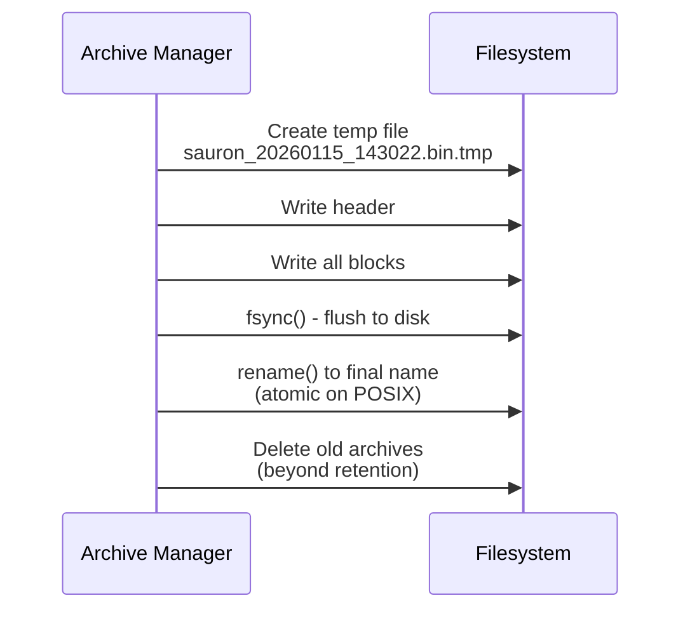

### Archive Management

- **Naming**: `sauron_YYYYMMDD_HHMMSS.bin`
- **Retention**: Configurable (default: 3)
- **Load**: `se_load_latest()` finds most recent by filename

## API Design

### Function Categories

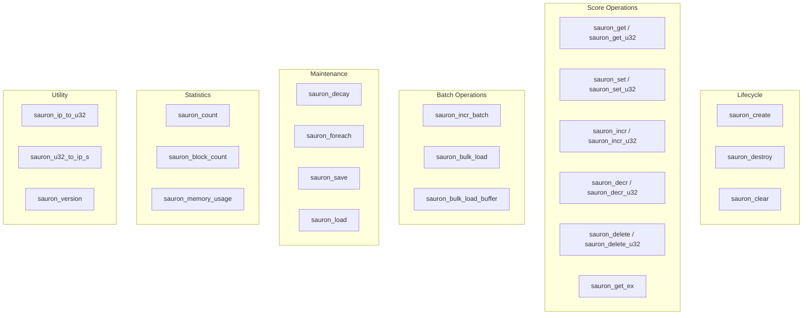

### Bulk Loading

For efficient loading of threat intel feeds, Sauron supports bulk CSV loading:

**CSV Format:**
```
IP,CHANGE
192.168.1.1,100      # Set score to 100
192.168.1.2,+50      # Add 50 to current score
10.0.0.1,-25         # Set to -25 (absolute negative)
10.0.0.2,+-10        # Subtract 10 from current score
```

**Key design insight**: The `+` prefix indicates a relative update. Without `+`, the value is absolute. This allows mixing absolute resets and incremental updates in the same file.

**Result structure:**
```c
typedef struct sauron_bulk_result {
    uint64_t lines_processed;   // Total lines read
    uint64_t lines_skipped;     // Invalid or parse errors
    uint64_t sets;              // Absolute sets performed
    uint64_t updates;           // Relative updates performed
    uint64_t parse_errors;      // Lines with parse errors
    double elapsed_seconds;     // Total time
    double lines_per_second;    // Processing rate
} sauron_bulk_result_t;
```

### Extended Operations

**`sauron_get_ex()`**: Get with explicit not-found reporting. Returns `SAURON_ERR_INVALID` if IP not found, allowing distinction between "score is 0" and "not in database".

**`sauron_clear()`**: Clear all scores without destroy/create cycle. Efficient for reinitializing.

**`sauron_foreach()`**: Iterate all scored IPs with callback. Useful for export, analysis, or custom algorithms.

### Return Values

| Code | Name | Description |
|------|------|-------------|
| 0 | SAURON_OK | Success |
| -1 | SAURON_ERR_NULL | NULL pointer argument |
| -2 | SAURON_ERR_INVALID | Invalid argument or IP not found |
| -3 | SAURON_ERR_NOMEM | Memory allocation failed |
| -4 | SAURON_ERR_IO | File I/O error |

Score functions (`sauron_get`, `sauron_incr`, etc.) return the score value directly. Use `sauron_get_ex()` when you need to distinguish "score is 0" from "not found".

## Project Structure

Standard autotools-based C library project:

```
~/git/Sauron_Lib/
├── bootstrap                    # Runs autoreconf -ifv
├── configure.ac                 # Autoconf configuration
├── Makefile.am                  # Root automake
├── m4/
│   └── version.m4               # VERSION_NUMBER
├── include/
│   ├── config.h.in              # Generated
│   ├── common.h                 # Common definitions
│   ├── sysdep.h                 # Portability
│   └── sauron.h                 # Public API
├── src/
│   ├── Makefile.am              # lib + bin
│   ├── sauron.c                 # Core implementation (all components inline)
│   ├── sauron_cli.c             # CLI utility
│   ├── mem.c / mem.h            # Memory management
│   └── util.c / util.h          # Utilities
├── python/
│   ├── __init__.py              # Package init
│   └── sauron.py                # ctypes wrapper with full API
├── examples/
│   ├── Makefile                 # Example build
│   ├── example_basic.c          # Basic C usage demo
│   ├── example_concurrent.c     # C concurrent stress test
│   ├── stress_test.c            # Comprehensive stress test with metrics
│   ├── example_specter.py       # Python usage for Specter_AI
│   └── example_concurrent.py    # Python concurrent stress test
├── tests/
│   ├── Makefile                 # Test build
│   ├── test_basic.c             # Basic functionality (26 tests)
│   ├── test_threading.c         # Concurrency tests (7 tests)
│   ├── test_performance.c       # Performance benchmarks (14 tests)
│   ├── test_edge_cases.c        # Edge cases/error handling (88 tests)
│   └── test_python.py           # Python binding tests
├── docs/
│   └── ARCHITECTURE.md          # This file
├── sauron.3.in                  # Library man page
├── sauron-cli.1.in              # CLI man page
└── [standard GNU files]
```

### Test Coverage

Total: 135 tests across 4 C test files plus Python tests.

| File | Tests | Coverage |
|------|-------|----------|
| test_basic.c | 26 | Core operations, save/load, decay |
| test_threading.c | 7 | Concurrency, parallel access |
| test_performance.c | 14 | Benchmarks with performance targets |
| test_edge_cases.c | 88 | Boundary conditions, error handling, bulk loading |

## Build System

```bash
./bootstrap              # Generate configure
./configure [options]    # Configure build
make                     # Build library + CLI
make check               # Run tests
make install             # Install
```

### Configure Options

| Option | Description |
|--------|-------------|
| --enable-debug | Debug symbols, assertions |
| --enable-memdebug | Memory leak detection |
| --enable-hardening | Security flags (default: yes) |
| --enable-static-analysis | cppcheck/clang-tidy targets |

## CLI Utility

Interactive interface for testing and debugging:

```
$ sauron-cli
sauron> get 192.168.1.100
0
sauron> incr 192.168.1.100 10
10
sauron> incr 192.168.1.100 5
15
sauron> stats
Scores: 1
Blocks: 1
Memory: 2.6MB
sauron> decay 0.9 5
Modified: 1
sauron> get 192.168.1.100
13
sauron> save
Saved: /var/lib/sauron/sauron_20260115_143022.bin
sauron> quit
```

## Measured Performance

### Single-Threaded

| Operation | Target | Achieved | Factor |
|-----------|--------|----------|--------|
| GET (u32) | 2M ops/sec | 165M ops/sec | 82x |
| SET (u32) | 2M ops/sec | 70-97M ops/sec | 35-48x |
| INCR (u32) | 2M ops/sec | 102M ops/sec | 51x |
| GET (string) | - | 15M ops/sec | - |
| Decay | - | 738M scores/sec | - |

### Multi-Threaded (8 cores)

| Operation | Achieved | Notes |
|-----------|----------|-------|
| GET | 687M ops/sec | Near-linear scaling |
| SET | 140M ops/sec | Limited by allocation |
| INCR (same /24) | 10M ops/sec | Intentional contention test |

### Concurrent Stress Test (4 readers, 2 writers, bulk loader, decay)

| Operation | Achieved |
|-----------|----------|
| Reads | 85M ops/sec |
| Writes | 9M ops/sec |

### Memory Efficiency

| Metric | Value |
|--------|-------|
| Base footprint | 2.6MB (bitmap + context) |
| Per /24 block | ~540 bytes |
| 100K scores across 391 blocks | 2.7MB total |

## Design Decisions Summary

| Decision | Choice | Rationale |
|----------|--------|-----------|
| Data structure | Two-level + bitmap | O(1) lookup, memory efficient, cache friendly |
| Score type | int16_t | Sufficient range, minimal memory |
| Thread safety | Lock-free reads, per-CIDR spinlock writes | Reads dominate; writes infrequent |
| Block deallocation | Free empty blocks | Memory efficiency; safe ordering |
| Persistence | Multiple archives with retention | Startup restore, periodic snapshots |
| Allocation failure | Abort process | malloc failure is catastrophic |
| RFC1918/CGNAT | Handle (not bogon) | Internal networks need tracking |
| CIDR granularity | Fixed /24 for MVP | Simple, efficient; variable mask for v2 |
| Bulk loading | CSV with SET/relative syntax | Flexible threat intel feed ingestion |

## Future Enhancements (v2.0+)

1. **Variable CIDR Mask**: Density-based block sizing
2. **IPv6 Support**: Separate hash-based structure
3. **Distributed Mode**: Sharding across multiple instances
4. **Bloom Filter**: Optional pre-filter for very sparse data
5. **SIMD Optimization**: Vectorized decay operations
